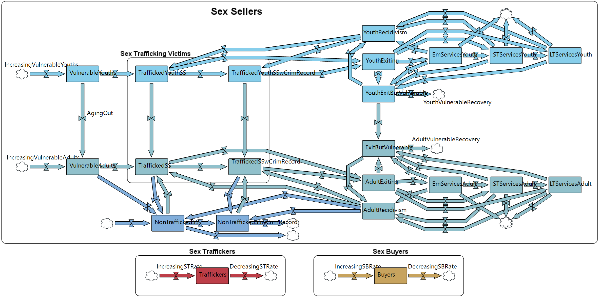

# Sex Trafficking in Massachusetts: System Dynamics Model & Policy Analysis

This repository contains a system dynamics model (SDM) of sex trafficking and commercial sex work (CSW) in Massachusetts, along with a Python-based sensitivity analysis and policy evaluation framework. The project is intended to support evidence-based policy decision-making by simulating how interventions — such as prosecution strategies, service provision, and decriminalization — affect trafficking outcomes over time.



---

## Repository Structure

```
Trafficking-in-MA/
├── ParamEstimates.xlsx               # Parameter estimates used to calibrate the model
├── SupplyDemandEstimates.xlsx        # Supply/demand estimates for baseline calibration
│
├── Sex_Trafficking_SDM/              # AnyLogic system dynamics model & simulation outputs
│   ├── Sex_Trafficking_SDM.alp       # AnyLogic model file (open with AnyLogic)
│   ├── PolicyScenarios.xlsx          # Policy scenario definitions fed into model runs
│   ├── LHSVariationOutput_default.csv      # 5,000 LHS simulation runs (default bounds)
│   ├── LHSVariationOutput_manual.csv       # 5,000 LHS simulation runs (manual bounds)
│   ├── OATVariationOutput_manual.csv       # OAT simulation runs (manual bounds)
│   ├── CSWPolicyScenarioOutput_2026_03_17.csv  # Policy scenario simulation outputs
│   └── database/                     # AnyLogic embedded HSQLDB database files
│
├── SexTraffickingAnalysis/           # Python sensitivity analysis and visualization code
│   ├── sensitivity_analysis_param_generation.py  # Generate LHS/OAT parameter samples
│   ├── sensitivity_analysis.py                   # LHS-based PRCC/SRCC analysis
│   ├── sensitivity_analysis_oat.py               # One-at-a-time sensitivity analysis
│   ├── policy_visualization.py                   # Policy scenario figures
│   ├── lhs_samples.xlsx                          # Generated LHS parameter sets (default bounds)
│   ├── lhs_samples_manual_bounds.xlsx            # Generated LHS parameter sets (manual bounds)
│   ├── oat_samples.xlsx                          # Generated OAT parameter sets (default bounds)
│   ├── oat_samples_manual_bounds.xlsx            # Generated OAT parameter sets (manual bounds)
│   ├── sensitivity_results/          # LHS sensitivity analysis outputs (CSV + figures)
│   ├── sensitivity_results_oat/      # OAT sensitivity analysis outputs (CSV + figures)
│   └── policy_figures/           # Policy scenario visualization figures
│
└── SexTraffickingPaper/              # Research paper resources
    └── model_diagram.png             # System dynamics model diagram
```

---

## Components

### 1. AnyLogic System Dynamics Model (`Sex_Trafficking_SDM/`)

The core model is `Sex_Trafficking_SDM.alp`, an AnyLogic model file implementing a system dynamics simulation of the commercial sex and trafficking ecosystem in Massachusetts.

**What it models:**
- Population flows for adult and youth sex sellers — entry, service utilization, exit, and recidivism
- Separate tracked pathways for trafficked vs. non-trafficked individuals
- Buyer and trafficker dynamics driving demand
- Effects of criminal prosecution on sellers, buyers, and traffickers
- Expungement policy effects on criminal records
- Emergency, short-term, and long-term social service capacity and routing
- Post-service vulnerability and recidivism

**Model inputs** are defined by the ~58 parameters documented in `ParamEstimates.xlsx` and `SupplyDemandEstimates.xlsx`. Policy scenario inputs are defined in `PolicyScenarios.xlsx`.

**Key model outputs:**
| Output | Description |
|---|---|
| `TotalTSS` | Total trafficked sex sellers |
| `TotalSS` | Total sex sellers (trafficked + non-trafficked) |
| `pctTraffickedVsNontrafficked` | Share of sex sellers who are trafficked |
| `pctSSCrimRecord` | Share of sex sellers with a criminal record |
| `Traffickers` | Number of active traffickers |
| `Buyers` | Number of active buyers |
| `demand` | Overall commercial sex demand |
| `AdultRecidivism` | Rate of return to sex work post-exit |
| `cost` | Total policy intervention cost |

**To use:** Open `Sex_Trafficking_SDM.alp` in [AnyLogic](https://www.anylogic.com/) (Personal Learning Edition or licensed version).

---

### 2. Python Analysis Framework (`SexTraffickingAnalysis/`)

A Python 3.12 project for sensitivity analysis and policy visualization, using outputs exported from AnyLogic model runs.

**Setup:**

```bash
cd SexTraffickingAnalysis
# Install dependencies (uses uv)
uv sync
# Or with pip:
pip install matplotlib numpy pandas scipy openpyxl
```

#### Step 1 — Generate Parameter Samples

```bash
python sensitivity_analysis_param_generation.py
```

Generates parameter sets for sensitivity analysis runs using two methods:

- **Latin Hypercube Sampling (LHS):** 5,000 quasi-random samples spanning the full parameter space simultaneously. Used to identify which parameters have the most influence on outputs, accounting for interactions between parameters.
- **One-At-a-Time (OAT):** Sweeps each parameter individually (10 steps per parameter) while holding all others at their default values. Used to communicate the individual effect of each parameter in isolation.

Outputs four Excel files (`lhs_samples.xlsx`, `lhs_samples_manual_bounds.xlsx`, `oat_samples.xlsx`, `oat_samples_manual_bounds.xlsx`) that are loaded into AnyLogic to run the corresponding batches of simulations.

#### Step 2 — Run Simulations in AnyLogic

Import the generated sample files into the AnyLogic model and run the parameter variation experiments. Export results as CSV files into `Sex_Trafficking_SDM/`:
- `LHSVariationOutput_*.csv` for LHS runs
- `OATVariationOutput_*.csv` for OAT runs
- `CSWPolicyScenarioOutput_*.csv` for policy scenario runs

#### Step 3 — Run Sensitivity Analysis (LHS)

```bash
python sensitivity_analysis.py
```

Reads `LHSVariationOutput_manual.csv` and computes:

- **PRCC (Partial Rank Correlation Coefficient):** Measures the influence of each input parameter on each output *after statistically controlling for all other parameters*. The primary metric for identifying high-leverage parameters.
- **SRCC (Spearman Rank Correlation Coefficient):** Raw rank correlation without partialing out other parameters.

Outputs to `sensitivity_results/`:
- `prcc_table.csv`, `prcc_pvalues.csv`, `srcc_table.csv` — tabular results
- Tornado plots (one per output, parameters ranked by |PRCC|)
- Heatmap of all parameters × all outputs
- Scatter plots for top 3 influential parameters per output
- Power analysis curves

#### Step 4 — Run OAT Sensitivity Analysis

```bash
python sensitivity_analysis_oat.py
```

Reads `OATVariationOutput_manual.csv` and computes a **Signed Sensitivity Index (SSI)** — the direction and magnitude of each parameter's individual effect, expressed as percent change from baseline.

Outputs to `sensitivity_results_oat/`:
- `oat_signed_si.csv`, `oat_pct_change.csv` — tabular results
- Tornado plots (signed SI, one per output)
- Response curve plots (output vs. parameter sweep for top parameters)
- Heatmap

#### Step 5 — Visualize Policy Scenarios

```bash
python policy_visualization.py
```

Reads `CSWPolicyScenarioOutput_*.csv` and generates publication-ready figures comparing policy scenarios across all key outcomes:
- Heatmap of % changes from baseline
- Grouped bar chart
- Diverging bar chart
- Absolute change panels
- Absolute value panels with baseline reference

Outputs to `policy_figures/`.

---

## Workflow Summary

```
ParamEstimates.xlsx
SupplyDemandEstimates.xlsx
        │
        ▼
 AnyLogic Model (Sex_Trafficking_SDM.alp)
        │
        ├─── sensitivity_analysis_param_generation.py
        │           generates lhs_samples.xlsx / oat_samples.xlsx
        │                       │
        │                       ▼
        │           AnyLogic: run batch experiments
        │                       │
        │           LHSVariationOutput_*.csv
        │           OATVariationOutput_*.csv
        │                       │
        │           ┌───────────┴────────────┐
        │           ▼                        ▼
        │   sensitivity_analysis.py   sensitivity_analysis_oat.py
        │   (PRCC/SRCC)               (OAT / Signed SI)
        │           │                        │
        │   sensitivity_results/     sensitivity_results_oat/
        │
        └─── PolicyScenarios.xlsx
                    │
                    ▼
        AnyLogic: run policy scenario experiment
                    │
        CSWPolicyScenarioOutput_*.csv
                    │
                    ▼
          policy_visualization.py
                    │
            policy_figures/
```

---

## Parameter Categories

The model includes ~58 parameters across six categories:

| Category | Examples |
|---|---|
| Recruitment & crime | `st_recruitment`, `org_crime_prevalence`, `trafficking_educ` |
| Population | `total_adult_population`, `pop_pct_adult_homeless`, `childhood_violence` |
| Prosecution & policy | `prosecution_culture` variants, `prosecution_mult`, `pctExpungement` |
| Adult services | `em_services_capacity`, `st_services_capacity`, `base_adult_recovery_rate` |
| Youth services | `em_youth_services_capacity`, `base_youth_recovery_rate` |
| Supply/demand & economics | `buyer_base_trns`, `csw_acceptance`, `sb_benefit`, `risk_cross_effect` |
